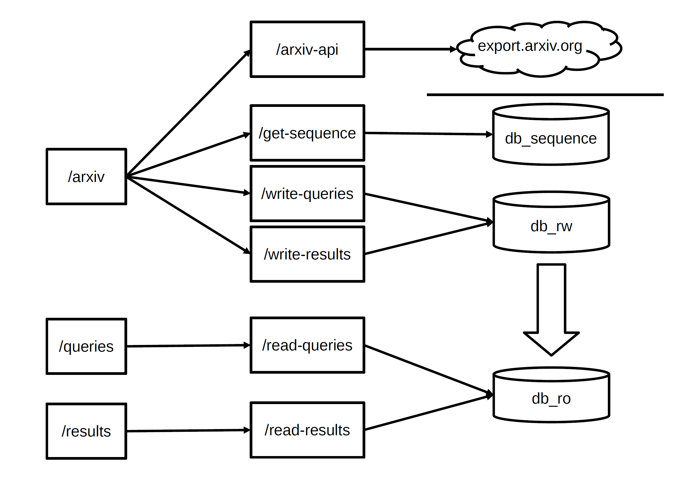

# fastapi-arxiv

## Project organization

I've created 10 separate stateless microservices as API endpoints.

The 4 `frontend` endpoints receive user requests, process the input parameters and have some "business logic".

The 4 `frontend` endpoints call the 6 `backend` API endpoints, what each are doing one specific simple task, like read the external Arxiv API, write or read DB records.



### Frontend
  - `GET /arxiv`:
    Fetches data from the external Arxiv API through `GET /arxiv-api` enpoint, based on search parameters (`author`, `title`, `journal`).
    Gets a unique ID from `GET /get-sequence`.
    Then inserts the processed external arXiv API reponse to two DB  tables with the same ID separately, calling: `POST /write-queries` and `POST /write-results`.
    Returns metadata about the search including `timestamp`, `status`, and the `number of results` of the external API read.
  - `GET /queries`:
    Returns data about previously executed queries within a specified timestamp range, returned as a JSON file for download.
  - `POST /queries`:
    Returns data about previously executed queries within a specified timestamp range, returned as a JSON object.
  - `GET /results`:
    Fetches result data through an internal API, allowing pagination and filtering, suitable for displaying search results in client applications.

### Backend
  - `GET /arxiv-api`:
    Queries the external arXiv API using search parameters (author, title, journal) and returns parsed results along with the response's timestamp and HTTP status code, providing insights into the arXiv articles fetched.
  - `GET /get-sequence`:
    Retrieves a unique sequence value from the database using psycopg2, bypassing known issues with sequence objects in SQLAlchemy, typically used for generating unique identifiers for new database entries.
  - `GET /read-queries`:
    Fetches query records from the database within a given timestamp range, using asynchronous database access for efficient data retrieval.
  - `GET /read-results`:
    Provides paginated access to results data stored in the database, supporting efficient browsing through potentially large datasets.
  - `POST /write-queries`:
    Receives query data as JSON and saves it into the database, providing an endpoint for logging and tracking query activities programmatically.
  - `POST /write-results`:
    Takes result data as JSON input and stores it in the database, used for archiving the outcomes of queries for future retrieval or analysis.


### Directory structure

#### All together
  The `fastapi` directory contains all API endpoints together.
  
  It needs minimal effort to create separate FastAPI instances for all of the endpoints by keeping only the code related to the endpoint.

  This can be deployed with `docker-compose-all-together.yml`.
  
#### Backend and Frontend  
  The `frontend` directory contains frontend API endpoints together, and the `backend` directory contains frontend API endpoints together. 

  This can be deployed with `docker-compose.yml`.


## wait-for.sh side-quest
To let the FastAPI `backend` instance wait for the startup of the PostgreSQL DB,
and the FastAPI `frontend` instance wait for `backend`, I've created a shell script by correcting some flaws:

https://github.com/pvamos/wait-for


## Database

### Reducing data volume
- I'm storing the query string sent to the external Arxiv API without the trailing `ArXiv Query: ` string what is always present. When reading the `queries` table, I concatenate this prefix back with the SQL query.
- I'm using unix timestamp format when storing time values to the DB, and also at internal calls between the frontend and backend endpoints.

### Tables
These database tables are used:

```sql
-- For storing query metadata
CREATE TABLE queries (
    id SERIAL PRIMARY KEY,   -- ID and primary key
    query_id BIGINT,         -- Unique identifier of the query (from sequence, same as in the results table)
    timestamp BIGINT,        -- Unix timestamp of the query (same as in the results table)
    status SMALLINT,         -- HTTP status code of the response
    num_results SMALLINT,    -- Number of results found reported by the query
    num_entries SMALLINT,    -- Number of result entries returned (and stored) by the query
    query TEXT               -- The actual query string sent to arXiv
);

-- For storing individual results from each query
CREATE TABLE results (
    id SERIAL PRIMARY KEY,   -- ID and primary key
    query_id BIGINT,         -- Unique identifier of the query (from sequence, same as in the queries table)
    timestamp BIGINT,        -- Unix timestamp of the result (same as in queries table)
    result_number SMALLINT,  -- The sequential number of result for the query
    author TEXT,             -- Author(s) of the publication
    title TEXT,              -- Title of the publication
    journal TEXT             -- Journal reference, if available
);
```
The database tables are handled independently, they can even be on separate systems.

### PostgreSQL Sequence

I use a PostrgeSQL sequence to generate a unique ID for each query. This ID value is saved to both the `queries` and `results` table records in relation, and this ID is usable to "join" the `queries` and `results` table records despite they are written separately in async manner.

```sql
-- To provide a unique ID for the query and the connectinq results records
CREATE SEQUENCE arxiv_sequence
    INCREMENT 1
    START 1
    MINVALUE 1
    CACHE 1;
```

### DB optimized for async writes and reads instead of ACID
In production the writable `queries` and `results` tables can be in two separate database services, and they can be replicated separately to many readable replica instances behind two separate load balancers. The writable databases can alos utilize a few Master-Master replicated instances behind load balancers, if higher throughput is needed.

This separate indepentent database arrangement is capable of much higher write performance, as it can be written with asychronous actions.

With this DB concept, the readable data tables will have correct data to query EVENTUALLY -> So we need to filter out too new records by filtering based on the timestamp value in each record.


## Logging

I use `logging` module from Python's standard library.
I'm logging to the container logs, the underlying container platform can simply collect it.

The most containerization solutions (including Docker and Kubernetes) can send the container logs to standardized external logging systems, like:
- syslog / syslog-ng / rsyslog
- Logstash -> ELK
- fluentd -> Elasticsearch, MongoDB...
- HDFS
- S3
- Graylog
- Google / Amazon cloud logging
- ...
 
### Added `NOTICE` custom log level
Python's `logging` module supports only these 5 levels: `DEBUG`, `INFO`, `WARNING`, `ERROR`, `CRITICAL`.

Implemented the `NOTICE` standard syslog level "missing" from python logging.

The logging configuration is in `fastapi/app/main.py`.

The log level is configurable through the `LOG_LEVEL` environment variable set in the docker-compose yaml.

### Log levels and their use
I use these levels:
- `ERROR`:  Impacting errors.
- `WARN`:   Error but not impacting, like error formatting one of the returned parameter values (returning none...)
- `NOTICE`: Log messages of normal operation, like the API endpoint calls. Other (library etc.) logs send less noise, as it is above `INFO`.
- `INFO`:   Less detailed debug-ish logs, like function calls with parameter values.
- `DEBUG`:  Detailed debug logs, like function return values.

The logging configuration is in `fastapi/app/main.py`.

### Log messages to help building Unit tests

The API endpoints log input parameter values with `NOTICE` log level.
Other functions log input parameter values with `INFO` log level.
With `DEBUG` log level the functions before returning also log the result value together with the input parameter values.

```
2024-05-06 18:58:09,788 NOTICE frontend - arxiv_router.search_arxiv - search_arxiv(author=None, title=Budapest, journal=None, max_results=1): called
2024-05-06 18:58:09,788 INFO frontend - arxiv_functions.fetch_arxiv_data - fetch_arxiv_data(author=None, title=Budapest, journal=None, max_results=1): called
2024-05-06 18:58:09,788 INFO frontend - arxiv_functions.build_query_params - build_query_params(author=None, title=Budapest, journal=None, max_results=1): called
2024-05-06 18:58:09,789 DEBUG frontend - arxiv_functions.build_query_params - build_query_params(author=None, title=Budapest, journal=None, max_results=1): returning: {'title': 'Budapest', 'max_results': 1}

```

## Unit Testing
The solution has been decomposed into many small functions that can be tested separately: this makes the testing a much less complex task.

The `DEBUG` level log messages containing the function input parameter values together with the return value of the function makes writing unit tests much easier, following the general approach described at:

How To Write Unit Tests For Existing Python Code 
https://www.youtube.com/watch?v=ULxMQ57engo
https://www.youtube.com/watch?v=NI5IGAim8XU
https://github.com/ArjanCodes/2022-test-existing-code


## How to scale the solution

The project is organized into separate stateless microservice API endpoints.

Kubernetes has extensive horizontal pod autoscaling capabilities for Deploments, Docker Swarm can also scale replicated services.

Each endpoint can also scale horizontally in more "manual" way behind a HAProxy or similar.

The incoming external API requests can also be distributed with some proxy/reverse proxy solution capable of HTTP request path based routing, like HAProxy, Nginx, etc, or some cloud providers solution.

Separate the writable database(s) from the readable database(s).

Writable PostgreSQL databases can scale less easily with active-active replication.

Database read operations can scale relatively easily, we can create many replicas for reading.

If we really need robust write performance, we should use a scaleable DB solution, like MongoDB.

If we expect load spikes, then we should use a message queing or stream processing solution in front of PostgreSQL, like Kafka, Nifi, RabbitMQ or similar, to buffer and manage data flows efficiently, ensuring system stability and performance scalability.


## License

MIT License

Copyright (c) 2024 Péter Vámos  pvamos@gmail.com  https://github.com/pvamos

Permission is hereby granted, free of charge, to any person obtaining a copy
of this software and associated documentation files (the "Software"), to deal
in the Software without restriction, including without limitation the rights
to use, copy, modify, merge, publish, distribute, sublicense, and/or sell
copies of the Software, and to permit persons to whom the Software is
furnished to do so, subject to the following conditions:

The above copyright notice and this permission notice shall be included in all
copies or substantial portions of the Software.

THE SOFTWARE IS PROVIDED "AS IS", WITHOUT WARRANTY OF ANY KIND, EXPRESS OR
IMPLIED, INCLUDING BUT NOT LIMITED TO THE WARRANTIES OF MERCHANTABILITY,
FITNESS FOR A PARTICULAR PURPOSE AND NONINFRINGEMENT. IN NO EVENT SHALL THE
AUTHORS OR COPYRIGHT HOLDERS BE LIABLE FOR ANY CLAIM, DAMAGES OR OTHER
LIABILITY, WHETHER IN AN ACTION OF CONTRACT, TORT OR OTHERWISE, ARISING FROM,
OUT OF OR IN CONNECTION WITH THE SOFTWARE OR THE USE OR OTHER DEALINGS IN THE
SOFTWARE.